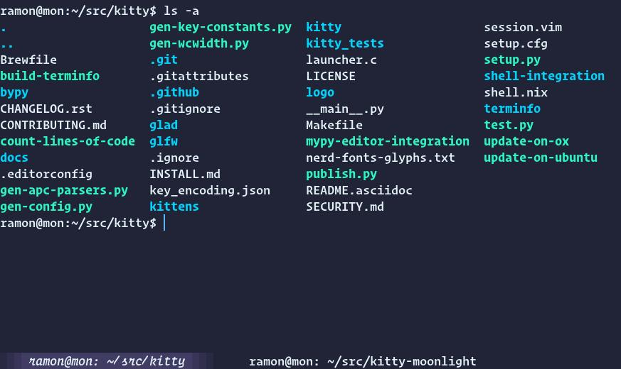

# kitty-moonlight

> A port of moonlight vscode extension for kitty terminal

## Installation

1. Download the theme to `~/.config/kitty/kitty-themes/themes`
2. Include it in your kitty configuration with the `include` directive (more information at [https://sw.kovidgoyal.net/kitty/kittens/themes/](https://sw.kovidgoyal.net/kitty/kittens/themes/))
